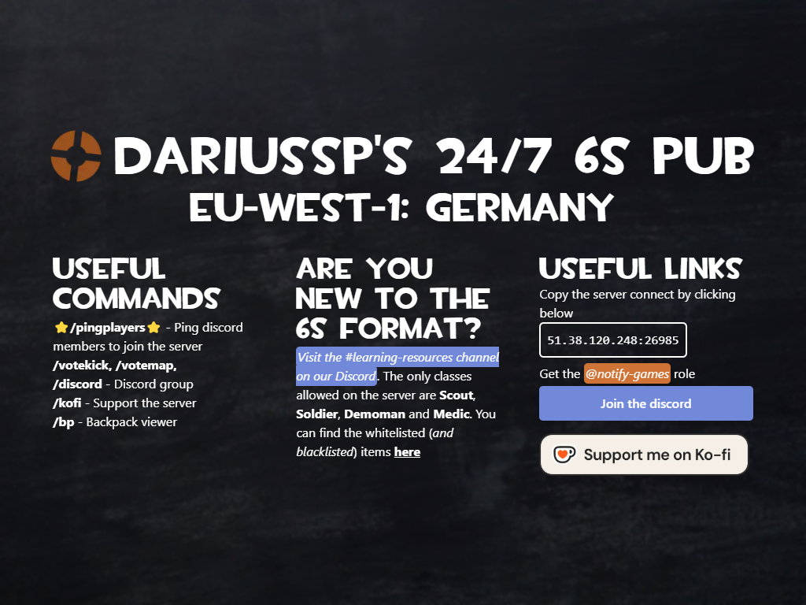

# Dariussp's TF2 Servers Message of The Day

## Table of Contents

1. [Current Version](#current-version)
   - [Normal Variant](#normal-variant)
   - [Christmas Variant](#christmas-variant)
2. [Tools Used](#tools-used)
3. [Discord](#discord-server)
4. [Past Verstions](#past-versions)

## Current Version

### Normal Variant

### Christmas Variant

> This variant get's automatically shown if the current month is either December or January.

## Tools Used

- [Astro.build](https://astro.build/)
- [TailwindCSS](https://tailwindcss.com/)

## Discord Server

If you're interested in playing some Team Fortress 2 with people who like the 6s RGL format, [join our Discord server here](https://discord.com/invite/DwAq9srYZJ)

## Past versions

> None. Yet. :D
